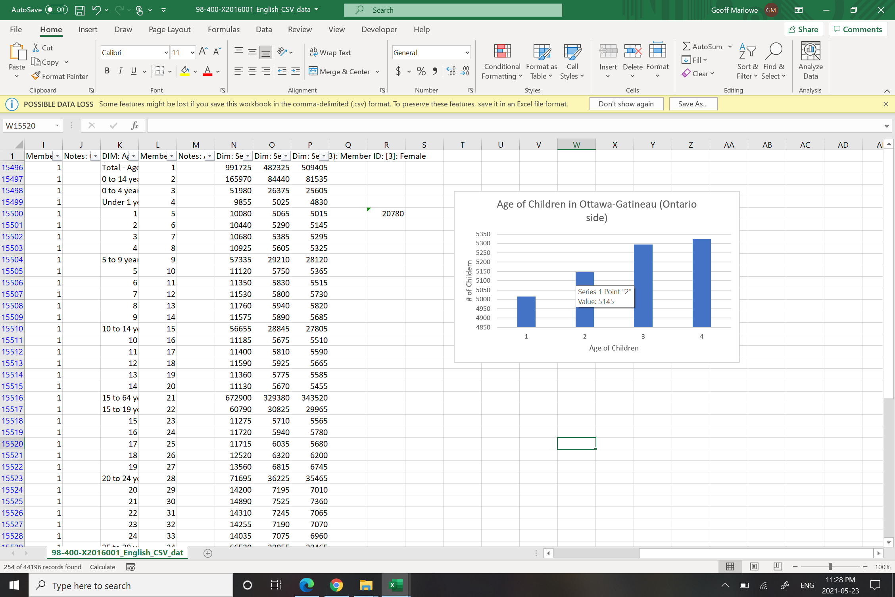
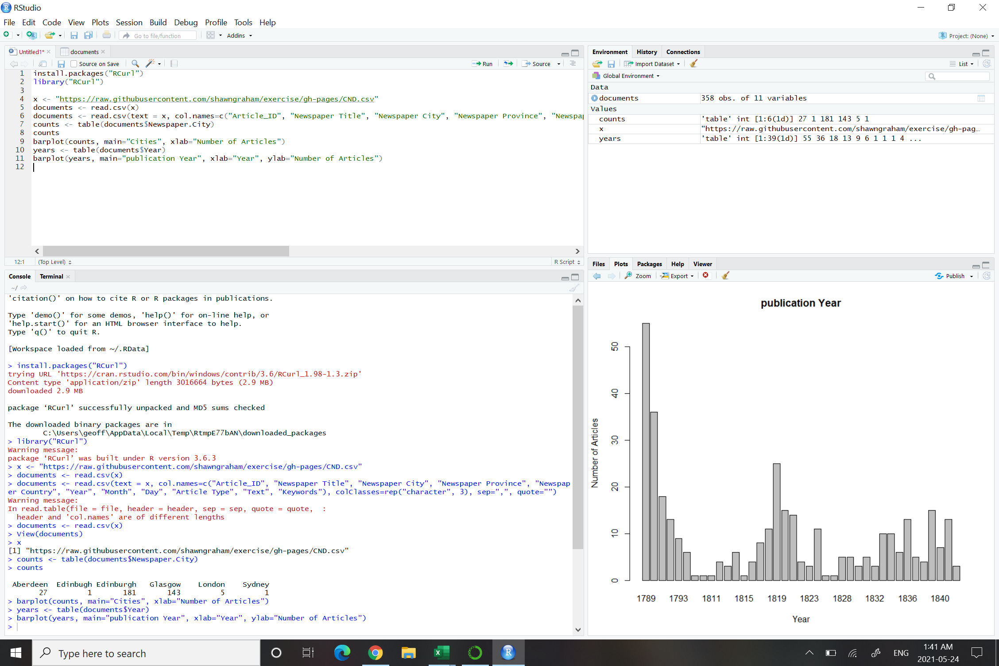

# Week Two: Log
## Excel
- So I had a little frustration and difficulty with excel. Here I was assuming Excel was going to be the easiest part of this class, because who hasn't used excel right? Wrong.
- I saved and unzipped the file (Canadian 2016 Census).
  - I also needed to google what was meant by "_unzip_" a file and how to do it. A zipped file means the file is "_compressed_." All that needs to be done is, right click the compressed folder and select Extract. Or on Windows 10 (possibly other systems) when you click the compressed/ zipped file, it'll say "_Extract_" at the top of the window.
- Opening the now uncompressed file to excel was another issue. Selecting "open" through excel would say either the file was empty or could not be opened. **SO**, I went back to files/ documents app, went to the file ENG_CSV that the data was stored in, selected the 4 documents inside the folder and clicked _open with excel_.
- Another problem: the _"text Import Wizard"_ came up with 3 steps of questions for each document. I kept them at the setting they were set at, because I have absolutely no idea what any of the prompts/ questions meant. **Surprise,** it didn't work. The data came up all weird (I forgot to screenshot it). So, I closed it and tried opening the files again, I selected the opposite of what I had the first time, the first prompt being "Delimited" or "fixed width". I chose "delimited". I didn't change anything else, I still have no idea what they meant. **This time it worked!** 
    - The rest of the tutorial for excel went well! Found _column D_, '_GEO_NAME_', selected it, unchecked '_select all_', and selected '_Ottawa- Gatineau (Ontario Part)_'. Highlighted the 4 specified cells (female children aged 1 to 4), did the =sum(), got the correct values as stated on the tutorial.
    - Next, to choose two columns: highlighting ages 1 through 4, holding the ctrl. clicked and dragged again on the counts.
    - Creating a chart: Click  'insert', 'recommended charts' and chose the bar graph. 

## Basics of Counting & Plotting in R

- So this time around, going into R, was much easier to navigate. I already knew the difference between the _script_ and the _console_ from my errors with last weeks tutorials. **However,** I did run into the same issues that many people in the class seemed to have. the "x <- getURL" didn't work for me, but the other option Dr. Graham gave did:

      x <- "https://raw.githubusercontent.com/shawngraham/exercise/gh-pages/CND.csv

      documents <- read.csv(x)

- I copied and pasted the next step "documents <- read.csv(text = x, col.names=c("Article_ID", "Newspaper Title", "Newspaper City", "Newspaper Province", "Newspaper Country", "Year", "Month", "Day", "Article Type", "Text", "Keywords"), colClasses=rep("character", 3), sep=",", quote="")" and kept getting error messages and suddenly my data in my documents was at 0. I retyped in everything with "y" instead of "x", as mentioned on the discord chat. The same thing happened. The first image  shows that there are "358 obs. of 11 variables". In the next image,  after typing in the next step, the "obs." is at 0. I'm not sure what happened. Am very frustrated. However, it is pretty late. So I will ask the discord channel in the morning.
- Okay so I wasn't able to quit for the night before trying one last time. I'm not exactly sure what changed (because I tried multiple times and thought I tried this way) but it worked for me.

      x <- "https://raw.githubusercontent.com/shawngraham/exercise/gh-pages/CND.csv"

      documents <- read.csv(x)  (**I think this was the missing step. I think i thought that when professor Graham wrote this in discord that he meant to continue on with the next step?)

      documents <- read.csv(text = x, col.names=c("Article_ID", "Newspaper Title", "Newspaper City", "Newspaper Province", "Newspaper Country", "Year", "Month", "Day", "Article Type", "Text", "Keywords"), colClasses=rep("character", 3), sep=",", quote="")

- This time everything worked out, the "obs." remained and I was able to successfully continue on!

- This was actually super cool to see and felt rewarding to get figure out the issues (that I probably created for myself) and that everything else ran smoothly.
- I didn't continue on with the "tarsus.txt" or "unicorn.txt" files, it felt like pushing my luck a little. This was enough confusion for one day. Will return to this, at a later date though.

## Wget

- Before I get started on this, just want to note that I'm a little nervous, it seems like a few people in the class had some difficulty with this program. Also "accidentally downloading the internet", that sounds like something I would accidentally do. So thank you professor for the warning! Reading the warnings, are a little scary though.

- Okay, **so** I was going to do this on a windows laptop, figuring it would be easier than my Macbook Air. **However,** I couldn't find a "windows directory" so, we're going to try my Macbook instead.
- Scratch that, back to Windows! (Macbook air terminal kept coming up with "_command not found_" when typing in the command given on the tutorial)
- Googled what was meant by C:\Windows directory: It is the _"windows" file_ within the _Local Disk (C:)._ Or I hope that is what the professor means anyways! (again did not get to work on this until late in the day). Moving on, I successfully downloaded the 32-bit version 1.20.3 EXE file of Wget and moved it to the _Windows_ file in the _Local Disk_.
- So far so good, now. Using the command prompt, I created a new directory as instructed my typing in:
        mkdir wget-activehistory

        cd wget-activehistory
- Now grabbing the index page page:
      wget http://activehistory.ca/papers
- It worked! Not sure if we're actually supposed to go look for the page, I'm not sure where it saved to.
    - Found it! It saved to Microsoft Edge.

- **Side note:** Some _flags_ to keep in mind:
      - **-r** recursive
      - **-np** no-parent
      - **-l** links beyond domain we started in
      - **-w** wait time between requests to the server
      - **--limit-rate=** limit bandwidth for request
- As instructed I entered the commands:

      $ wget -r -np -w 2 --limit-rate=20k

      http://activehistory.ca/papers/

- So I entered the commands separate, because thats what it looks like I am supposed to do on the tutorial. However I got the message saying "missing URL". I re-entered the command, but in one line.
- The command works! It took 15 minutes and 20 seconds for it all to load, downloading 128 files: as states at the end of the command prompt. Which I think is pretty neat. Found the files in Microsoft Edge.

**Next Step: Using wget with a list of URLS**
- When clicking the link to "the Laura A. Gamble fonds" or the link to "first image of her diary", I get a page saying "_[an error occurred while processing this directive] The requested URL was not found on this server. If you entered the URL manually please check your spelling and try again. [an error occurred while processing this directive]_"
- Tried the '_create a file in Sublime Text, copy & paste URL's and save as urls.txt._" Then tried in at the command prompt, but an error message of "No such file or directory. No URLs found in urls.txt." However, I double checked to see if my file saved and it did. So I'm not too sure why nothing showed up. I tried googling options for wget, but I'm not too sure what I'm looking for and it doesn't seem as if anyone else is having this issue.

**Using Python to Generate a List of URLs**
- Made a new directory "war-diaries" through the command prompt.
- Created new file in _Sublime Text_ with the script given. Saved as "urls.py"
- Opened anaconda powershell, searched the directory using pwd, followed by "war-diaries", but I got this:

- The last 2 parts of this assignment did not work for me, I tried to move the file from the windows folder in the local disk to the home screen, to the general 'documents' location. I kept getting the same message of "the file not existing" but when re-entering the "mkdir war-diaries" into powershell or command, it would say that it already existed (which it did considering I could physically see the folder). I tried asking a friend for some insight, but they weren't sure either since it seems I was doing everything correctly. I would have reached out to the class or the professor. But this is a day past the extension for when we were supposed to hand it in, so I was feeling a little embarrassed. Though I will have to come back and work through these issues at a later date, I think I read on the discord that we would be using this command in the future.  
